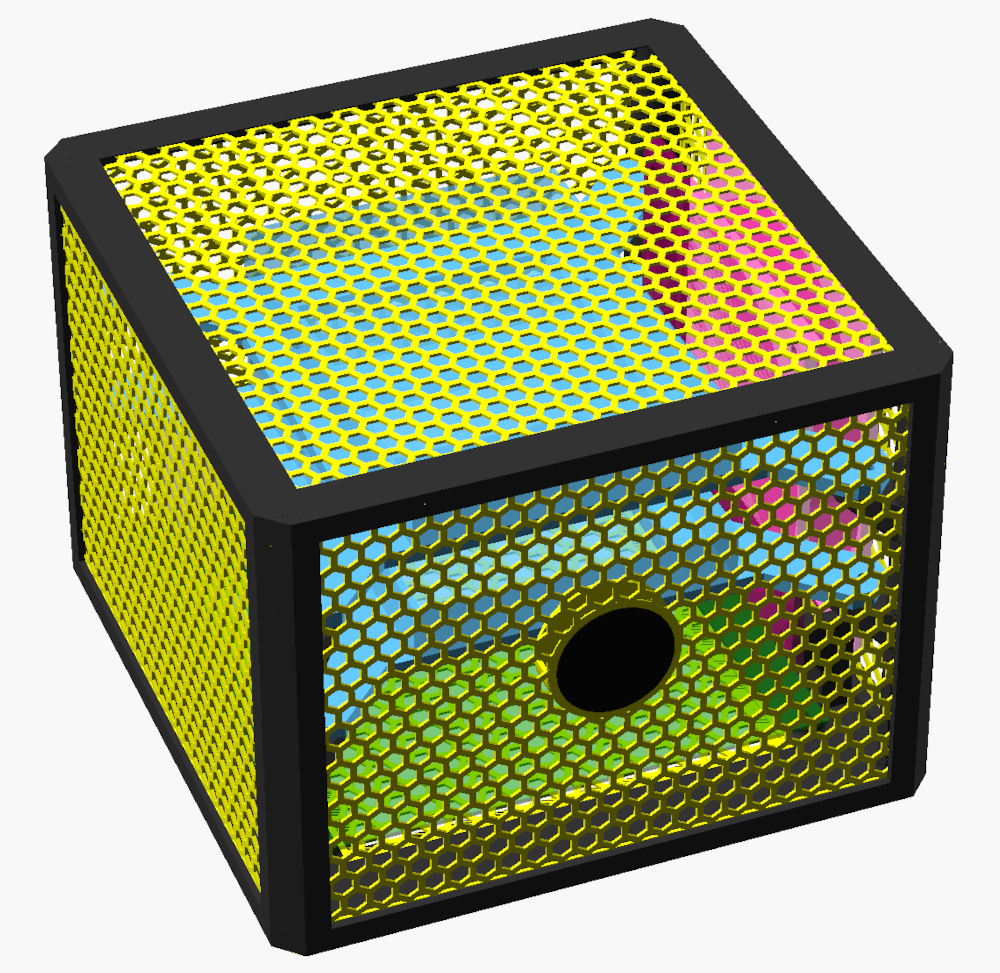
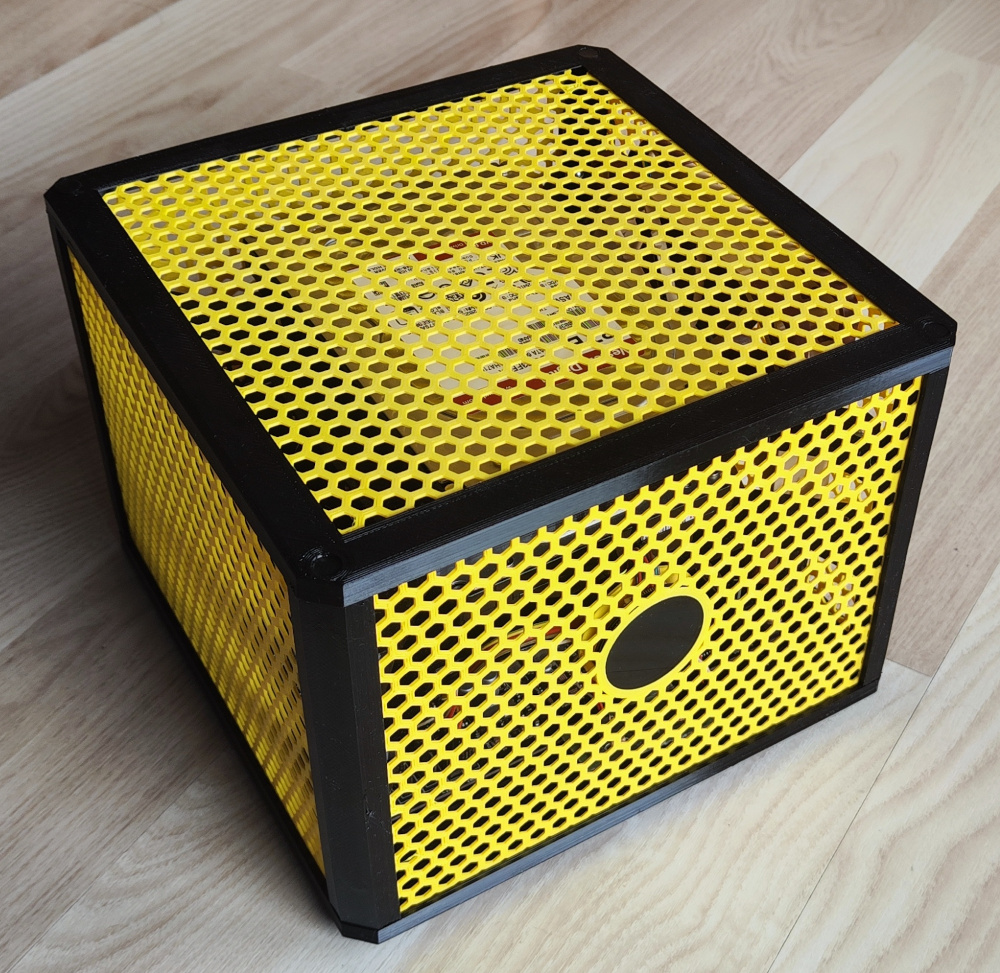
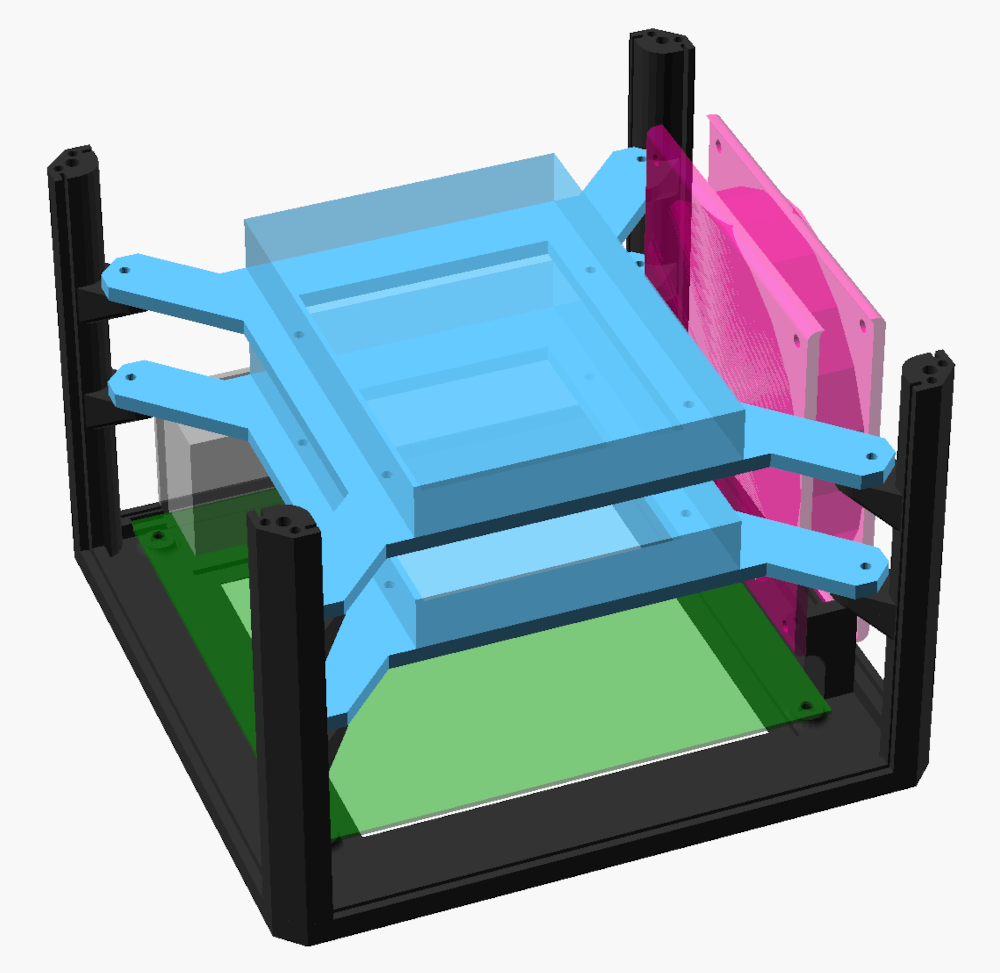
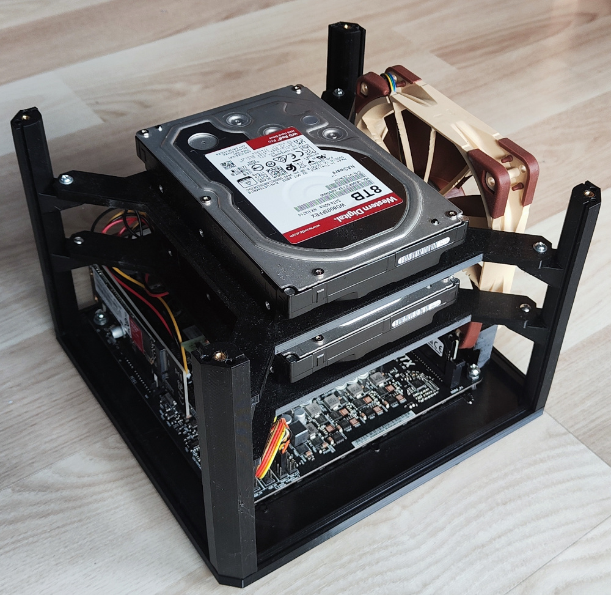

# Mini-ITX NAS case

I've decided to design my own case because I could not find any suitable case for 
a mini-ITX motherboard with two 3.5 HDDs and no ATX power supply. :sunglasses:

| Render                                                                                                                                         | Assembled                                                                                                                                          |
|------------------------------------------------------------------------------------------------------------------------------------------------|----------------------------------------------------------------------------------------------------------------------------------------------------|
|  |    |
|                |  |

## Features

* highly configurable (few configuration presents provided)
* support of mini-ITX motherboard with built-in power supply
* support of mini-ITX motherboard with Pico ATX power supply
* optional support for multiple 3.5" HDD drives
* optional support of 120mm case fan
* optional support of ESP32-S3-Touch-LCD-1.28 module used as a power button :metal:

## Pre-rendered variants

Check [stl](stl) folder for pre-rendered variants. 

## Customizing

1. Clone this repo
2. :warning: Download submodules:
    * `git submodule init`
    * `git submodule update`
3. Open [mini-itx-nas-case.scad](scad/mini-itx-nas-case.scad) and select base configuration preset (or create a new one)
4. You can override any variable defined in [base.scad](scad/config/base.scad)
5. Render all parts using OpenSCAD
   * :warning: do not render the whole case at once - it will not be printable
   * render each part separately - to render a single part, prefix it with `!` in [mini-itx-nas-case.scad](scad/mini-itx-nas-case.scad) and render

## Printing tips

* recommended material: `PETG` (`PLA` could bend if things get hot)  
* recommended material for case legs and caps: `TPU` 
* 0.6 nozzle is recommended to save some time 
* pillars and caps and legs must be printed in 4 copies
* only front panel with LCD slot requires support

## Assembly guide

1. print all parts 
2. glue top and bottom panels to top/bottom case part
    * :bulb: soldering borders using soldering iron also works well (join is invisible after assembly)
3. optionally glue legs to bottom part of the case
4. install brass inserts in bottom part and in all of the pillars
5. screw the motherboard to bottom part 
   * do not forget installing MB's backplate - later there would be no space for that
6. screw pillars to bottom part
7. if you have 3.5 HHD drive:
   * screw HDDs to frames
   * screw frames to pillars
8. install side panels
9. if using variant with fancy LCD module as a power button, follow [these](extra/ESP32-S3-Touch-LCD-1.28-firmware/) instructions 
10. screw top part to the pillars
11. optionally install caps to hide screws in top part

## Test setup

* **OS:** TrueNAS SCALE 24.04
* **Motherboard:** ASRock N100DC-ITX
* **Boot volume:** SSD WD Red SN700 250GB M.2 (yep, it's overkill. I know that now :see_no_evil:)
* **Apps volume:** SSD WD Red SN700 250GB M.2 using Ugreen PCIe 3.0 x4 M.2 PCIe NVMe expander
* **Data volumes:** 2x WD Red Pro 3.5" 8TB (mirror)
* **Fan:** Noctua NF-F12 PWM

Works well :rocket:
