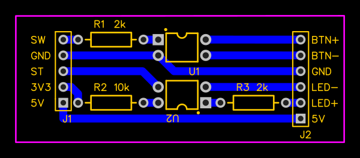

# ESP32-S3-Touch-LCD-1.28 as a power button

Not just a fancy power button.

## Features

* Turn on and off your computer with ease.
* Lock mode prevents accidental power switching; swipe to unlock.
* Customizable colors and backlight settings for personalization.
* Animated background to minimize LCD burn-in issues.
* Accessible via Wi-Fi for remote power control, setting adjustments, and firmware updates.
* Automatic power-on/off scheduling based on configurable hours (with NTP time synchronization).

## Requirements

* [ESP32-S3-Touch-LCD-1.28](https://www.waveshare.com/wiki/ESP32-S3-Touch-LCD-1.28) module
* [PlatformIO](https://platformio.org/)

## Flashing guide

1. Update `config.h` with your Wi-Fi network details:
2. Update configuration to your needs, especially:
    * `WIFI_SSID` in [config.h](src/config.h#L4)
    * `WIFI_PASS` in [config.h](src/config.h#L5)
    * You could also want to update:
        * `OTA_HOST` in [config.h](src/config.h#L11) and `upload_port` in [platformio.ini](platformio.ini#L40)
        * `TIMEZONE` in [config.h](src/config.h#L15)
3. For the first time, you need to flash the module using USB cable
    * Flash web server files: `pio run -e esp32 -t uploadfs`
    * Flash the firmware: `pio run -e esp32 -t upload`
    * Later, you can flash over Wi-Fi
        * Flash web server files: `pio run -e esp32_remote -t uploadfsota`
        * Flash the firmware: `pio run -e esp32_remote -t upload`

## PCB board

To connect the module with the motherboard safely, you need the following
PCB ([schematic](https://easyeda.com/editor#project_id=74e369fe8bb940fa985d3b2512d9eb14)):

### Parts

* `U1`, `U2` - PC817 DIP4
* `R1`, `R3` - resistor 2k ohm THT
* `R2` - resistor 10k ohm THT
* `J1` - gold pin 1x5
* `J2` - gold pin 1x6

### Wiring

| Port | Pin name | Description         | Connect to                                 |
|------|----------|---------------------|--------------------------------------------|
| `J1` | `SW`     | Power switch signal | `GPIO 21` of the module                    |
| `J1` | `GND`    | Ground              | `GND` pin of the module                    |
| `J1` | `ST`     | Power state signal  | `GPIO 33` of the module                    |
| `J1` | `3V3`    | 3.3V                | `3V3` pin of the module                    |
| `J1` | `5V`     | 5V                  | `VSYS` pin of the module                   |
| `J2` | `BTN+`   | Power button +      | Power button + signal from the motherboard |
| `J2` | `BTN-`   | Power button -      | Power button - signal from the motherboard |
| `J2` | `GND`    | Ground              | Any ground from motherboard                |
| `J2` | `LED-`   | Power LED -         | Power LED - signal from the motherboard    |
| `J2` | `LED+`   | Power LED +         | Power LED + signal from the motherboard    |
| `J2` | `5V`     | 5V                  | Any 5V power supply from motherboard       |

5V power supply from the motherboard should be always on to make the module work correctly.
Usually at least some USB ports provide 5V even the main supply is powered off.

### Accessing via browser

When the module is properly configured with Wi-Fi credentials, it can be accessed through 
a web browser using `http://[HOSTNAME].local` (default: http://button.local).

The available options include:

* Switching power on/off
* Setting up automatic power cycles:
    1. Go to settings.
    2. Enable "Auto On/Off".
    3. Optionally, enable "Power Loss On" if you want the power to be automatically 
       restored after a loss in active hours (unless manually turned off).
    4. Set the power-on hour (e.g., `06:30`).
    5. Set the power-off hour (e.g., `21:00`).
