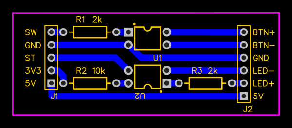

# ESP32-S3-Touch-LCD-1.28 as a power button

Not just a fancy power button.

## Features

* switch on/off the computer
* lock mode to prevent an accidental power switching (swipe to unlock)
* configurable colors and backlight 
* animated background to reduce LCD burn in
* accessible via Wi-Fi (switching power, settings, firmware update)
* automatic power on/off in configurable hours (with NTP time synchronization)

## Requirements

* [ESP32-S3-Touch-LCD-1.28](https://www.waveshare.com/wiki/ESP32-S3-Touch-LCD-1.28) module
* [PlatformIO](https://platformio.org/)

## Flashing guide

1. Update configuration to your needs, especially:
    * `WIFI_SSID` in [config.h](src/config.h#L4)
    * `WIFI_PASS` in [config.h](src/config.h#L5)
    * You could also want to update:
        * `OTA_HOST` in [config.h](src/config.h#L11) and `upload_port` in [platformio.ini](platformio.ini#L40)
        * `TIMEZONE` in [config.h](src/config.h#L15)
2. For the first time, you need to flash the module using USB cable
    * Flash web server files: `pio run -e esp32 -t uploadfs`
    * Flash the firmware: `pio run -e esp32 -t upload`
    * Later, you can flash over Wi-Fi
        * Flash web server files: `pio run -e esp32_remote -t uploadfsota`
        * Flash the firmware: `pio run -e esp32_remote -t upload`

## PCB board

To connect the module with the motherboard safely, you need the following
PCB ([schematic](https://easyeda.com/editor#project_id=74e369fe8bb940fa985d3b2512d9eb14)):

### Parts:

* `U1`, `U2` - PC817 DIP4
* `R1`, `R3` - resistor 2k ohm THT
* `R2` - resistor 10k ohm THT
* `J1` - gold pin 1x5
* `J2` - gold pin 1x6

### Wiring

| Port | Pin name | Description         | Connect to                                 |
|------|----------|---------------------|--------------------------------------------|
| `J1` | `SW`     | Power switch signal | `GPIO 21` of the module                    |
| `J1` | `GND`    | Ground              | `GND` pin of the module                    |
| `J1` | `ST`     | Power state signal  | `GPIO 33` of the module                    |
| `J1` | `3V3`    | 3.3V                | `3V3` pin of the module                    |
| `J1` | `5V`     | 5V                  | `VSYS` pin of the module                   |
| `J2` | `BTN+`   | Power button +      | Power button + signal from the motherboard |
| `J2` | `BTN-`   | Power button -      | Power button - signal from the motherboard |
| `J2` | `GND`    | Ground              | Any ground from motherboard                |
| `J2` | `LED-`   | Power LED -         | Power LED - signal from the motherboard    |
| `J2` | `LED+`   | Power LED +         | Power LED + signal from the motherboard    |
| `J2` | `5V`     | 5V                  | Any 5V power supply from motherboard       |

5V power supply from the motherboard should be always on to make the module work correctly.
Usually at least some USB ports provide 5V even the main supply is powered off.

### Accessing via browser

When module is configured correctly (Wi-Fi credentials), it can be accessed via the browser
using `http://[HOSTNAME].local` (default http://button.local).

Available options:

* switch the power on/off
* setup automatic power cycle:
    1. open options
    2. check `Auto on/off`
    3. optionally check `Power loss on`
        * the power will be restored after power loss in active hours (unless the power was turned off manually)
    4. setup power on hour (e.g `06:30`)
    5. setup power off hour (e.g `21:00`)
