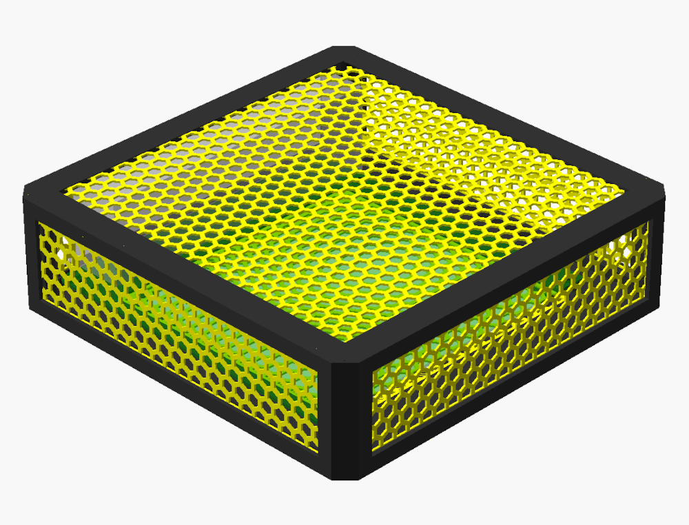
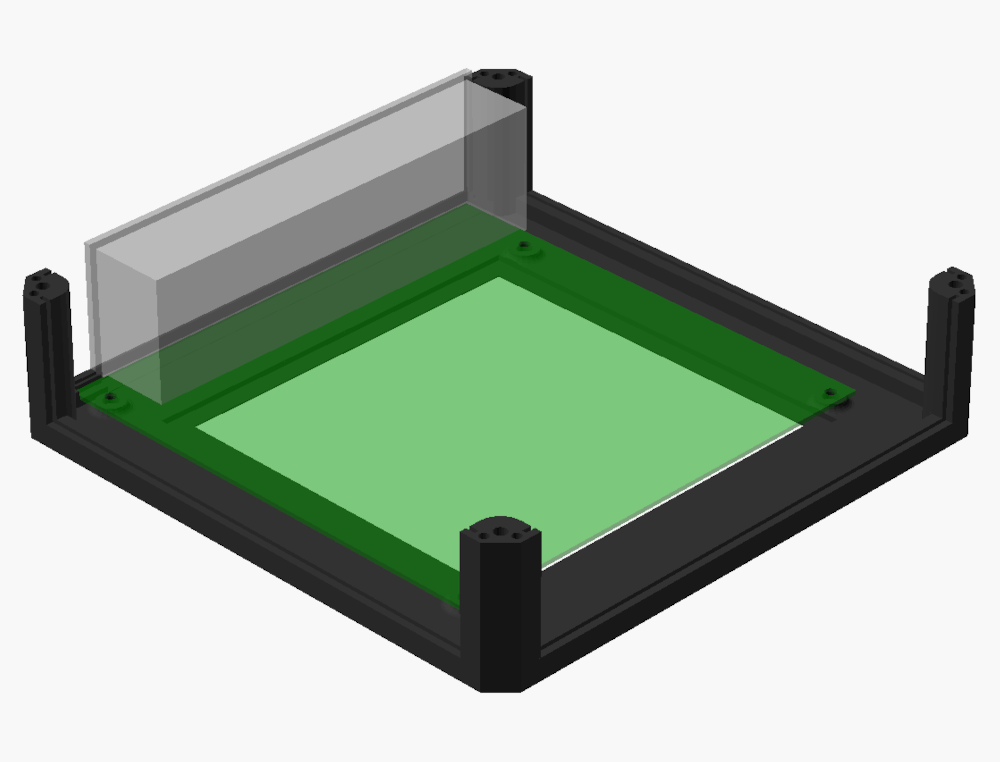
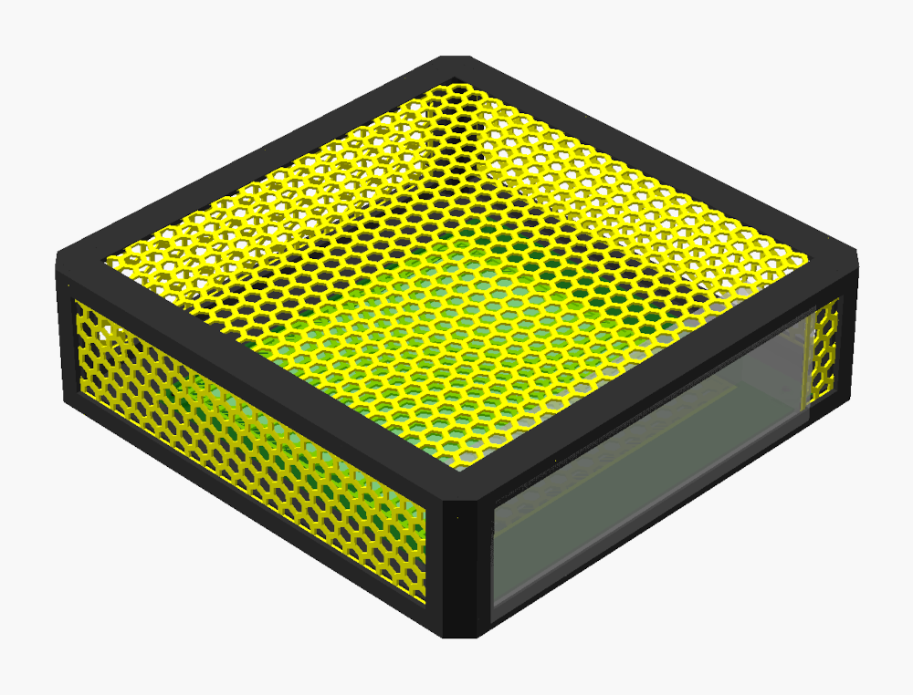

### Case configuration

* fanless mini-ITX motherboard (like N100DC-ITX)
* no HDD (so only M.2 SSD)

### Dimensions

* width:  `210mm`
* depth:  `210mm`
* height: `63mm` (`58mm` without legs)

**Configuration file**: :point_right:
[passive_mini_itx.scad](../../scad/config/passive_mini_itx.scad)
:point_left:

### Additional parts

* 8x M3x6x4.5 brass insert + 8x M3x10 screw for case assembly
* 4x M4x4x6 brass insert + 4x M4x6 screw for mounting the motherboard

### Printing and assembly guide

Check the main :point_right: [README.md](../../README.md) :point_left:

### Preview

