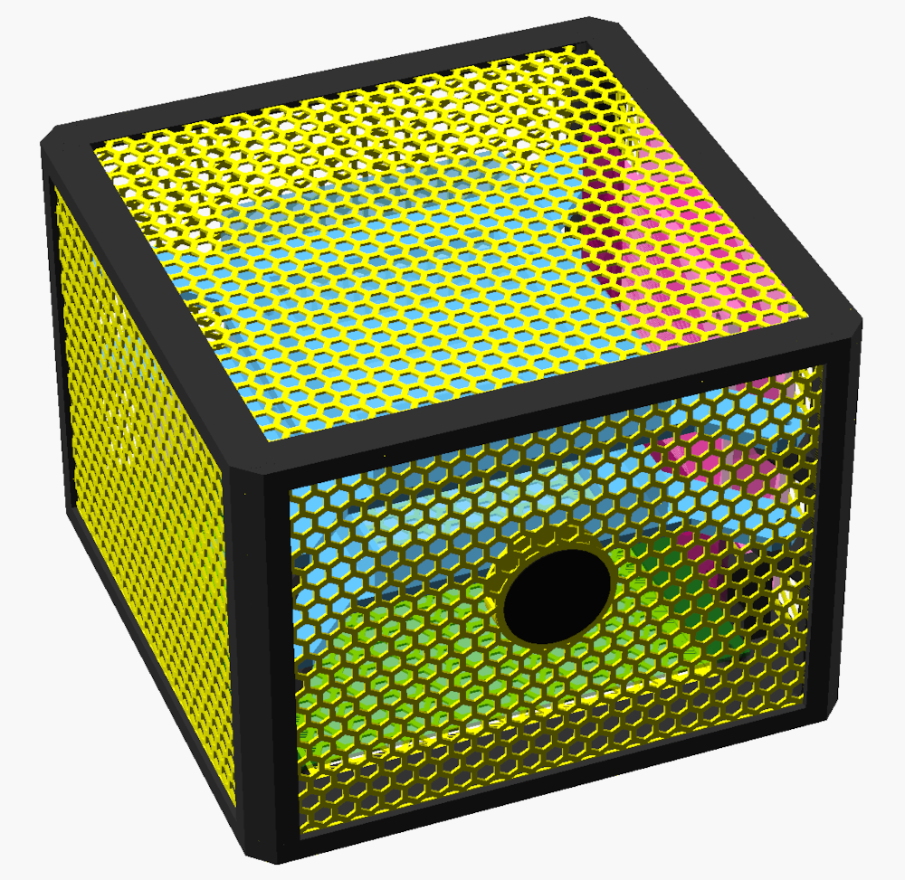
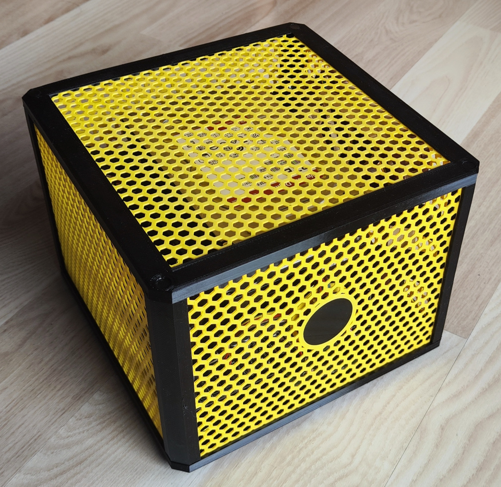
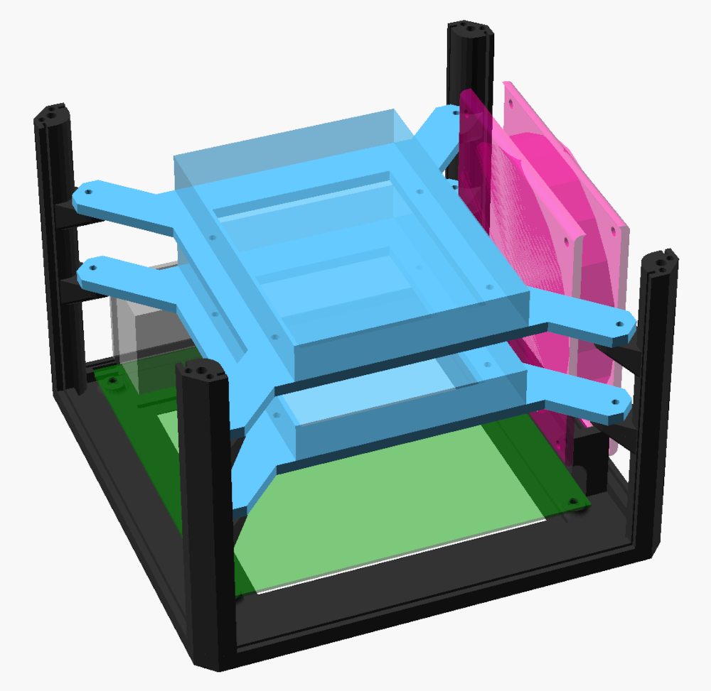
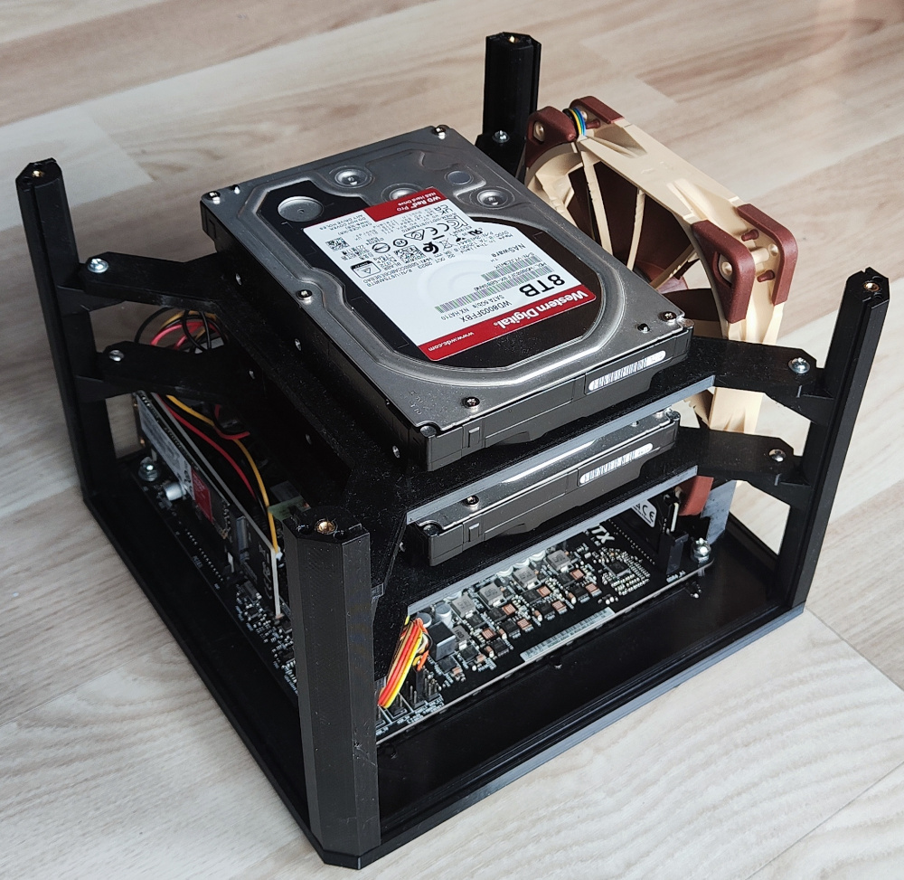
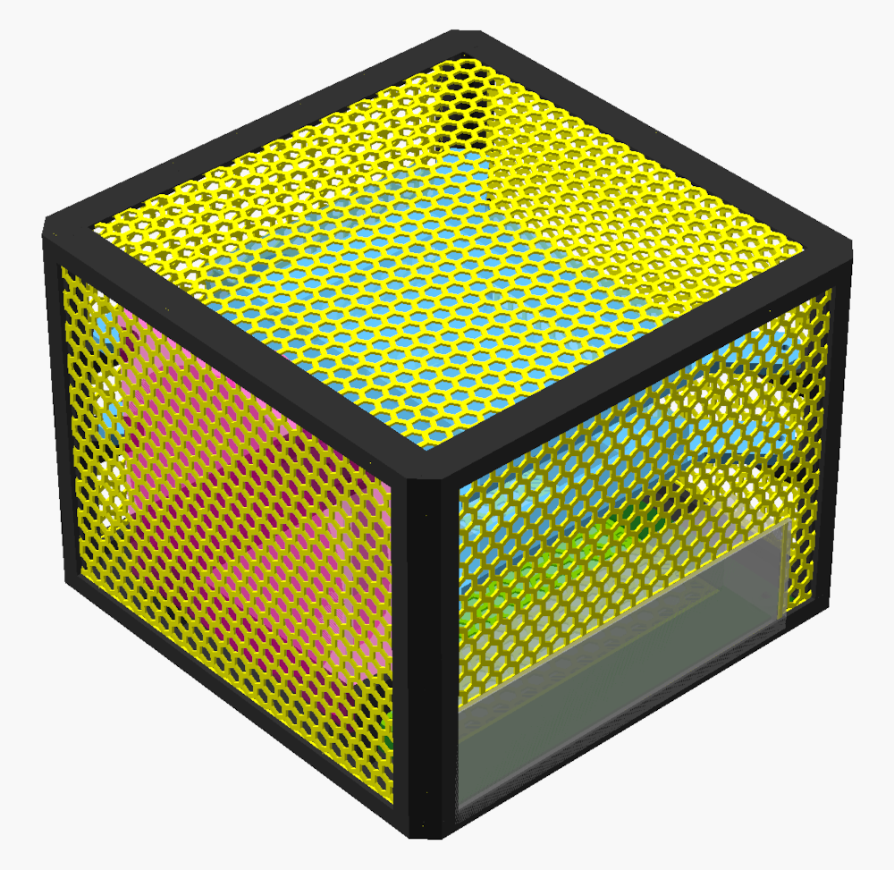
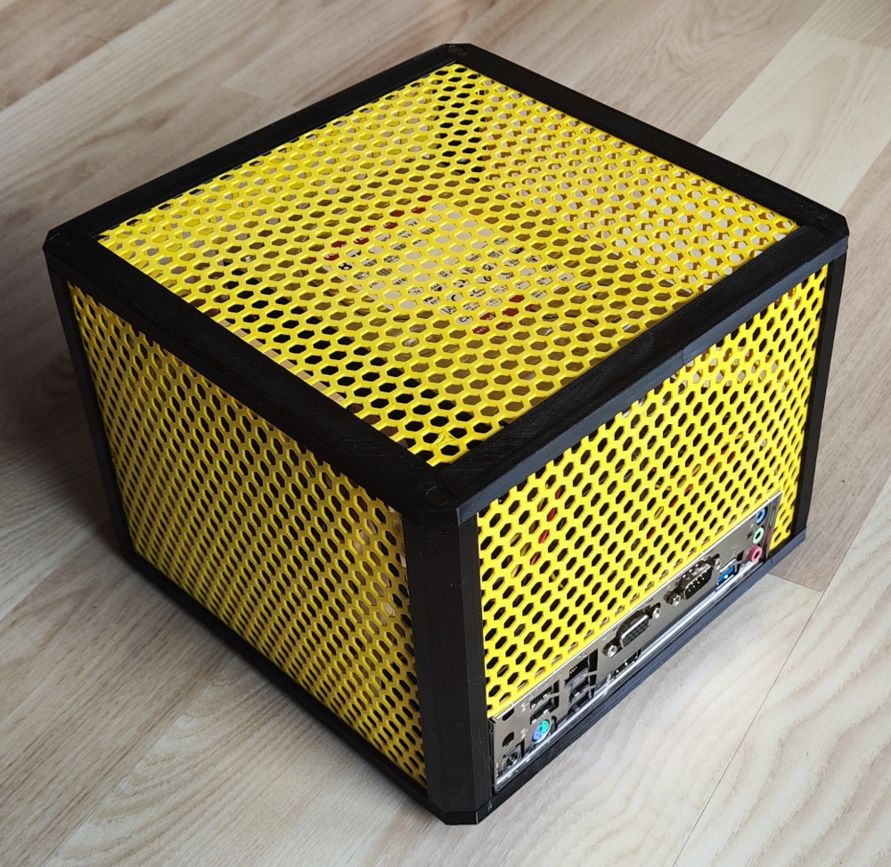

### Case configuration

* fanless mini-ITX motherboard (like N100DC-ITX)
* 2x 3.5" HDD
* optional 120mm fan
* ESP32-S3-Touch-LCD-1.28 on front panel as power button

### Dimensions

* width:  `210mm`
* depth:  `210mm`
* height: `161mm` (`156mm` without legs)

**Configuration file**: :point_right:
[passive_mini_itx_2x3.5_hdd_fan_lcd.scad](../../scad/config/passive_mini_itx_2x3.5_hdd_fan_lcd.scad)
:point_left:

### Additional parts

* 8x M3x6x4.5 brass insert + 8x M3x10 screw for case assembly
* 4x M4x4x6 brass insert + 4x M4x6 screw for mounting the motherboard
* 8x M3x3x4.5 brass insert + 8x M3x8 screw for mounting HDD frame to the case
* 8x UNC 6x10 screws for mounting HDD to HDD frame
* ESP32-S3-Touch-LCD-1.28 module

### Printing and assembly guide 

Check the main :point_right: [README.md](../../README.md) :point_left:

### Preview

| Render                                                                                                                    | Assembled                                                                                                                     |
|---------------------------------------------------------------------------------------------------------------------------|-------------------------------------------------------------------------------------------------------------------------------|
|  |    |
|                |  |
|    |      |
